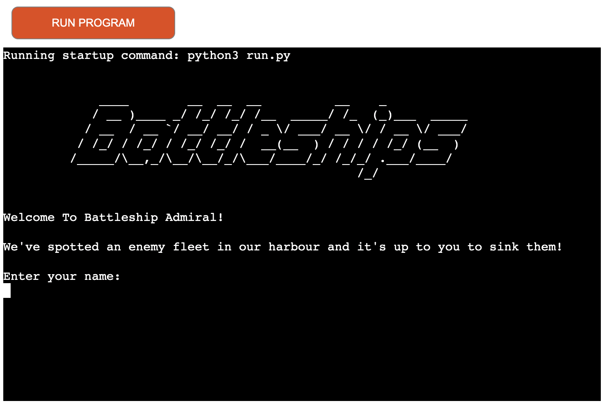
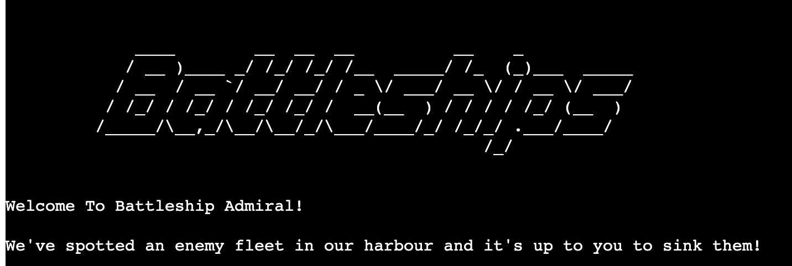
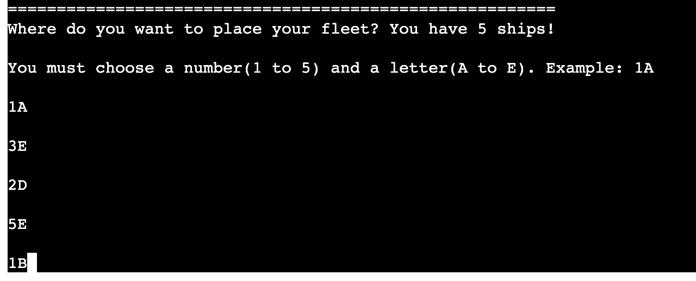
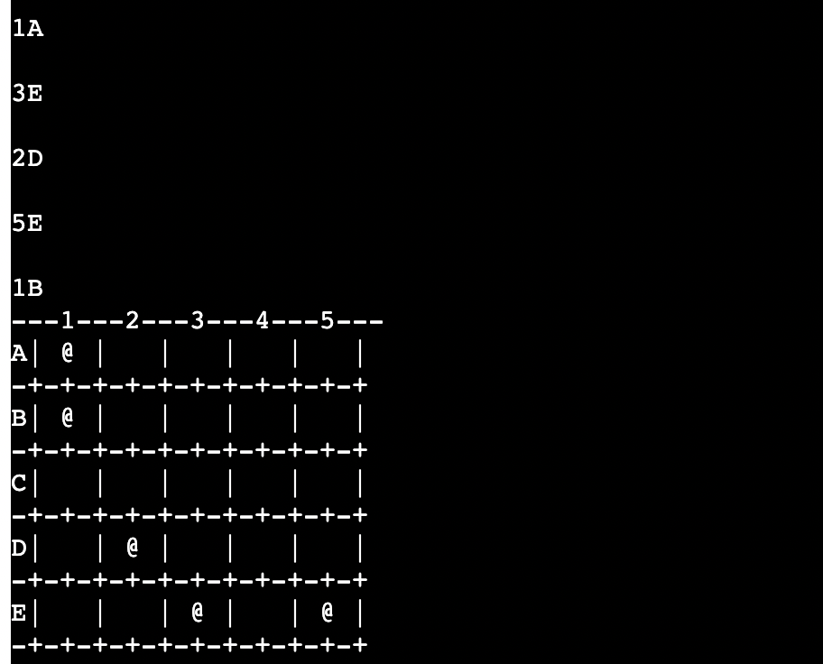
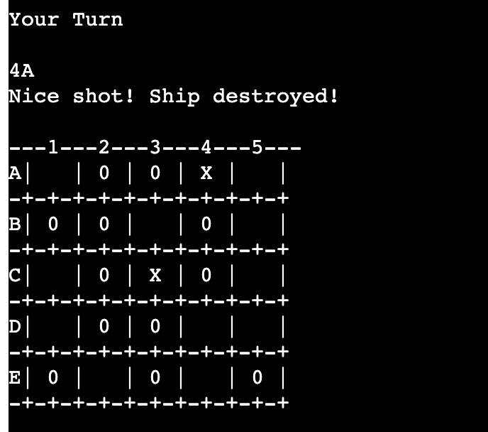
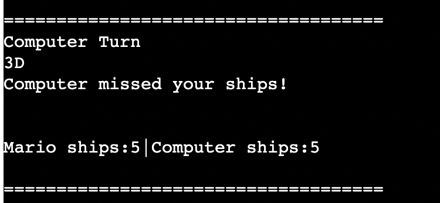
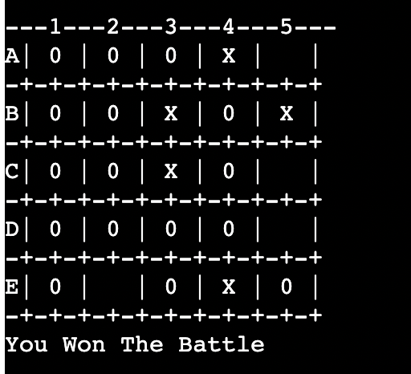
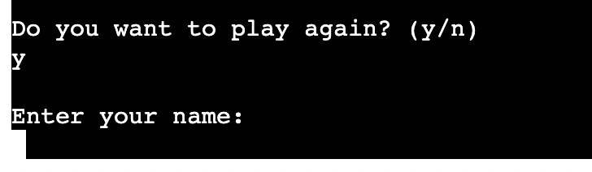
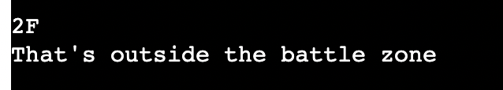
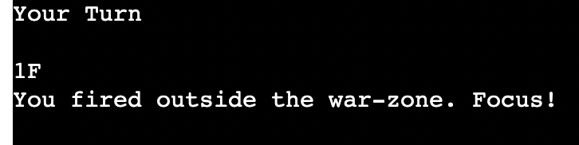

# Battleship
(Developer: Mario Castaldo)

[Live webpage](https://battleship-pp3-ci.herokuapp.com/)

## Table of Content

1. [Project Goals](#project-goals)
    1. [User Goals](#user-goals)
    2. [Site Owner Goals](#site-owner-goals)
2. [User Experience](#user-experience)
    1. [Target Audience](#target-audience)
    2. [User Requirements and Expectations](#user-requirements-and-expectations)
    3. [User Stories](#user-stories)
    4. [Site Owner Stories](#site-owner-stories)
3. [Technologies Used](#technologies-used)
    1. [Languages](#languages)
    2. [Frameworks & Tools](#frameworks-&-tools)
4. [Features](#features)
5. [Testing](#validation)
    1. [PEP8 validation](#pep8-validation)
    2. [Testing user stories](#testing-user-stories)
6. [Bugs](#Bugs)
7. [Deployment](#deployment)
    1. [EmailJS API](#emailjs-api)
8. [Credits](#credits)
9. [Acknowledgments](#acknowledgments)

## Project Goals
Battleship is a strategy type guessing game for two players. It is played on ruled grids on which each player's fleet of warships are marked. The locations of the fleets are concealed from the other player. Players alternate turns calling "shots" at the other player's ships, and the objective of the game is to destroy the opposing player's fleet.
[Wikipedia](https://en.wikipedia.org/wiki/Battleship_(game))

### User Goals
- Play the famous Battleship game on grids.

### Site Owner Goals
- Providing users with a logical game that is well presented grafically.

## User Experience

### Target Audience
- Children, Teenagers and Adults that share the interest of playing the Battleship game.

### User Requirements and Expectations
- Easy setup
- Easy to use

### User Stories
1. As a user, I want to be able to add my name.
2. As a user, I want to be able to place the ships on the board on the slots selected.
3. As a user, I want to be able to see my fleet on the board.
4. As a user, I want to be able to see on the board when I hit or miss the computer fleet.
5. As a user, I want to be able to see the computer choice and result.
6. As a user, I want to be able to see the result every turn.
7. As a user, I want to be able to see who won the game.

### Site Owner Stories
8. As a site owner, I want the user to get feedback in case of wrong input when placing the fleet.
9. As a site owner, I want the user to get feedback in case of wrong input during the battle.
10. As a site owner, I want the user to see the board filled in with hits and miss.
11. As a sire owner, I want the user to be able to play again without refreshing the page at the end of the game.

## Technologies Used

### Languages
- Python 3

### Frameworks & Tools
- gitHub
- Gitpod
- Git

### Welcome Message
- Shows a welcome message to the user

Welcome message

### Enter the Name
- The User is able to enter the name that will be displaied in the game.
- User stories covered: 1

Enter the Name

### Place the fleet
- The user is able to place 5 ships on the board.
- User stories covered: 2

Place the fleet

### Display user's fleet
- Displays the user's fleet on the selected slots.
- User stories covered: 3

Display user's fleet

### User Turn
- The user selects a slot on the board trying to guess where the computer fleet is.
- Displays a message to the user as a result of the turn.
- Displays the board with an '0' for missing the ship and an 'X' for destroying one.
- User stories covered: 4, 10

User Turn

### Remaining ships
- Displays the remaining ships after every turn
- User stories covered: 5, 6

Remaining ships

### Computer Turn
- Displays the guess made by the computer.
- Displays a message with the result of the guess made by the computer.
- Displays the result after the computer turn.
- User stories covered: 5

Computer Turn

### Final Result
- Displays a message with the winner of the battle once one of the player has destroyed the fleet of the other player.
- User stories covered: 7

Final Result

### Restart game 
- Asks the user to play again or to end the game.
- User can decide to play again ot to end the game.
- Restart the game
- User stories covered: 11

Restart game

### User Input Validation
- Displays a message to the user for a wrong input.
- User stories covered: 8, 9

User Input Validation

